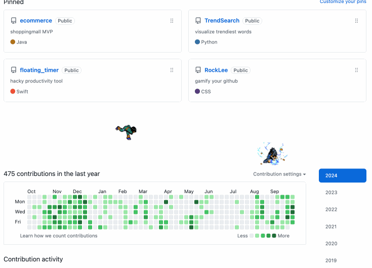

# A. What
github gamification app

1. 내가 commit할 수록 록리가 점점 각성한다.
2. 내 라이벌이 commit할 수록 사스케가 점점 각성한다.

# B. How to build & use?

1. `git clone https://github.com/Doohwancho/RockLee.js`
2. `npm i` (using node 16v)
3. `npm run build` (dist/에 웹팩으로 빌드된 파일이 생긴다.)
4. 크롬 확장 프로그램 관리에서 빌드한 파일 추가
5. debugging은 크롬 확장 프로그램 탭 -> 오류 클릭 -> 에러 로그가 뜬다.

# C. 이 프로젝트의 구조

## c-1. 오늘 commit 횟수에 따라 바뀌는 RockLee.gif Sasuke.gif 로드
1. 오늘 commit 횟수 가져온다.
    - 이 때, 기존엔 페이지가 로드 완료되는 시점에서 commit hitmap-calendar에 오늘 커밋 횟수가 있었으나, 패치가 되어 구조가 달라졌다.
    - 이제는 페이지 로드 완료 시점에 hitmap-calender안에 값이 로드되지 않으므로, 캘린더 안에 오늘 블록을 가르키는 DOM을 observer 패턴으로 걸어놨다가, 해당 돔이 로드 되면, 그 돔이 가르키는 'labeledby'의 값을 id 삼는 또 다른 돔을 observer해서, 해당 돔의 첫번째 값을 읽어야 오늘 커밋 수를 알 수 있다.
    - 만약 다른 방식을 쓰고싶다면, github이 제공하는 api가 있으면, 오늘 특정 유저의 커밋 숫자를 알려주는 http GET request를 날리는 식으로 처리할 수도 있다. 
2. 커밋횟수가 늘어날 수록, 해당 커밋 횟수에 맞는 RockLee.gif를 렌더링한다.
    - 이 때, RockLee2_transparent.gif는 sprite 이미지 파일로, src/style.css에서 css-animate를 이용해 프레임마다 다른 이미지를 가르키게 하여 마치 움직이는 듯한 효과를 준다.
3. 라이벌의 commit 횟수는 background.js에서 github api로부터 fetch()로 가져온 후, content.js로 값을 넘겨주어 css로 렌더링한다. 

## c-2. graph 형식의 skill tree (현재 미지원)

1. cytoscape.js라는 javascript library로, 그래프 자료구조를 시각화 하는 라이브러리를 사용하여, skill tree를 시각화 한다. 
2. 데이터는 src/model/csData.js에서 라이브러리가 요구하는 인풋 형식에 맞게 작성한다.
3. [cytoscape.js documentation](https://manual.cytoscape.org/en/stable/)

써보니 gamification 효과가 별로 없어서 기능 삭제함.

## c-3. profile picture이 commit 횟수에 따라 바뀌는 효과 (현재 미지원)

써보니 gamification 효과가 별로 없어서 기능 삭제함.

## c-4. 록리 대신 다른 캐릭터를 추가하고 싶다면?

1. 원하는 캐릭터의 sprite image 파일을 구한다. 
    1. ([naruto-sprite](https://www.spriters-resource.com/game_boy_advance/narutonc2/))에서 sprite 이미지를 구한다.
    2. [이 웹사이트](https://onlinepngtools.com/create-transparent-png)에서 특정 색깔을 투명하게 만들어 transparent image로 만든다.
2. sprite image에서 레벨 별로 css-animation을 이용해서 gif처럼 보이게 만든다.
3. RockLee.gif 대신 원하는 캐릭터.gif을 로드한다. 